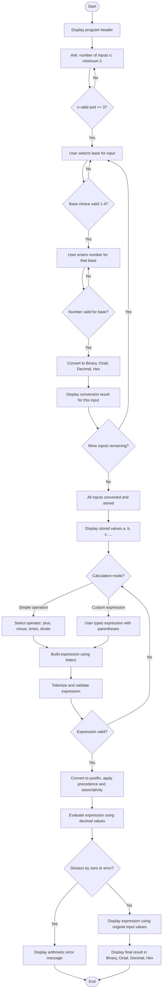

# Number System Converter and Arithmetic Calculator

A C# console application that converts numbers between Binary, Octal, Decimal, and Hexadecimal, and evaluates arithmetic expressions (with parentheses, operator precedence, and associativity) using those converted values.

---

# I. System Requirements

## Functional Requirements
- The system shall accept a minimum of 3 input numbers, with the user specifying the exact count.
- The system shall allow the user to select the number system (Base) of each input individually: Binary (2), Octal (8), Decimal (10), Hexadecimal (16).
- The system shall validate each input against the digit set allowed for its selected base.
- The system shall reject and re-prompt for any input that does not match its declared base.
- The system shall convert every valid input into all four number systems: Binary, Octal, Decimal, Hexadecimal.
- The system shall display the conversion result of each input individually.
- The system shall allow the user to select an arithmetic operation (Addition, Subtraction, Multiplication, Division) applied across all inputs, OR enter a custom expression using parentheses (e.g. (a+b-c)*d).
- The system shall convert all input values into decimal (a common representation) before performing arithmetic.
- The system shall follow standard operator precedence (* and / before + and -) and left-to-right associativity.
- The system shall display the arithmetic expression using the original input values.
- The system shall display the final result in Binary, Octal, Decimal, and Hexadecimal.
- The system shall handle arithmetic errors (division by zero, malformed expressions, unbalanced parentheses) without crashing.

## Non-Functional Requirements
- The program shall be implemented in C# as a console application.
- The program shall use functions/methods, decision structures (if/switch), and loops (while/for).
- Output shall be clear, organized, and consistently formatted.

## Hardware/Software Requirements
- .NET SDK (version 9.0 or compatible)
- Visual Studio Code (with C# Dev Kit extension)
- Windows OS (for running the compiled .exe natively)

---

# II. Algorithm / Pseudocode

## Part 1: Number System Converter

START

DISPLAY program header

REPEAT
    PROMPT number of inputs (n)
    IF n is not valid OR n < 3 THEN display error
UNTIL n is valid AND n >= 3

FOR i = 1 TO n DO
    letter = corresponding variable letter (a, b, c, ...)
    DISPLAY "INPUT NUMBER i (variable letter)"

    REPEAT
        DISPLAY base menu (Binary/Octal/Decimal/Hex)
        READ choice
        IF choice not between 1 and 4 THEN display error
    UNTIL choice is valid

    SET baseNumber from choice

    REPEAT
        PROMPT number in baseNumber
        TRY
            decimalValue = CONVERT input FROM baseNumber TO decimal
        CATCH error
            DISPLAY "Invalid number for this base"
    UNTIL conversion succeeds

    CONVERT decimalValue TO binary, octal, hexadecimal
    DISPLAY conversion result
    STORE input (original text, base, decimalValue) indexed by letter
END FOR

DISPLAY "CONVERSION COMPLETED"

## Part 2: Arithmetic Calculator

DISPLAY all stored values with their letters (a, b, c, ...)

REPEAT
    DISPLAY calculation mode menu:
        [1] Simple operation across all inputs
        [2] Custom expression with parentheses
    READ mode

    IF mode = 1 THEN
        SELECT operator (+, -, *, /)
        BUILD expression as "a op b op c op ..."
    ELSE
        PROMPT user to type a custom expression (e.g. "(a+b-c)*d")
    END IF

    TRY
        TOKENIZE expression into letters, operators, parentheses
        VALIDATE token sequence (balanced parentheses, correct operand/operator order)
    CATCH error
        DISPLAY "Invalid expression", RETRY
UNTIL expression is valid

CONVERT infix tokens TO postfix (Shunting-Yard algorithm)
    - operators * and / have higher precedence than + and -
    - equal-precedence operators evaluate left to right

TRY
    EVALUATE postfix expression using stored decimal values
    IF division by zero occurs THEN THROW arithmetic error
CATCH arithmetic error
    DISPLAY error message, ABORT calculation

IF no error THEN
    REBUILD expression using original input text (not letters)
    DISPLAY expression and decimal result
    IF result is a whole number THEN
        CONVERT result TO binary, octal, hexadecimal
        DISPLAY all four representations
    ELSE
        DISPLAY "not a whole number, other bases not applicable"
    END IF
END IF

END

---

# III. Flowchart

The diagram below shows the complete system as a single continuous flow: the Number System Converter (top portion) feeds its converted values directly into the Arithmetic Calculator (bottom portion).

---

# IV. Program Implementation

See `Program.cs` in this repository for the full C# source code.
A compiled, standalone executable is also included in the repository so the program can be run without needing VS Code or the .NET SDK installed.

The implementation is organized into functions covering two main phases:

**Converter phase:** `RunConverter()`, `GetNumberOfInputs()`, `GetBaseChoice()`, `GetValidNumber()`, `DisplayConversion()`

**Calculator phase:** `RunCalculator()`, `GetCalculationTokens()`, `GetOperatorChoice()`, `Tokenize()`, `ValidateTokenSequence()`, `ToPostfix()`, `EvaluatePostfix()`, `BuildExpressionDisplay()`, `DisplayFinalResult()`

Decision structures (if/switch) handle input validation and menu choices; loops (while/for) handle repeated prompting and iterating through inputs; try/catch blocks handle arithmetic and conversion errors.

---

# V. Test Cases

## Converter Test Cases

| Test # | Base Combination | Inputs | Expected Behavior |
|---|---|---|---|
| 1 | Binary + Octal + Decimal | 1010(bin), 17(oct), 255(dec) | Convert to a=10, b=15, c=255 decimal |
| 2 | Binary + Decimal + Hexadecimal | 1010(bin), 255(dec), 1A(hex) | Convert to a=10, b=255, c=26 decimal |
| 3 | Octal + Decimal + Hexadecimal | 17(oct), 255(dec), 1A(hex) | Convert to a=15, b=255, c=26 decimal |
| 4 | Binary + Octal + Hexadecimal | 1010(bin), 17(oct), 1A(hex) | Convert to a=10, b=15, c=26 decimal |
| 5 | Invalid input | 1029 as Binary | Rejected (digits 2, 9 invalid for base 2), re-prompted |
| 6 | Invalid menu choice | Choice = 7 | Rejected, re-prompted |
| 7 | Minimum boundary | Number of inputs = 2 | Rejected, must be at least 3 |

## Arithmetic Test Cases

Using 4 inputs: a=1010(bin)=10, b=17(oct)=15, c=255(dec)=255, d=1A(hex)=26

| Test # | Operation | Expression | Expected Decimal Result |
|---|---|---|---|
| 8 | Addition | a+b+c+d | 306 |
| 9 | Subtraction | a-b-c-d | -286 |
| 10 | Multiplication | a*b*c*d | 994500 |
| 11 | Division | a/b | 0.6666666666666666 |
| 12 | Parentheses + precedence | (a+b-c)*d | -5980 |
| 13 | Mixed precedence, no parentheses | a+b*c | 3835 (multiplication happens before addition) |
| 14 | Division by zero | a/e where e = 0 | Arithmetic Error: Division by zero is not allowed |
| 15 | Malformed expression | (a+b | Invalid expression: unmatched '(' |

---

# VI. Sample Output

Sample output is documented separately as code screenshots included in the submission file, showing actual program runs for each test case above (converter combinations, addition, subtraction, multiplication, division, parentheses/precedence, and error handling).

---

Author: Mantalaba
Course Activity: System Development Activity No. 1 - Number System Converter and Arithmetic Calculator