# Number System Converter and Arithmetic Calculator

A C# console application that converts numbers between Binary, Octal, Decimal, and Hexadecimal, evaluates arithmetic expressions (with parentheses, operator precedence, and associativity), and computes 1's/2's complements with complement-based subtraction.

---

## Update Log

- **v1 (previous submission):** Converter + Calculator, supporting parentheses, operator precedence/associativity, and arithmetic error handling. Submitted as `NumConverter_v1_Original` and left unmodified.
- **v2 (this submission — September 18, 2026):** Added 1's and 2's complement computation for every input, in all four number systems, plus subtraction using both the 1's complement method and the 2's complement method, per instructor's instruction dated September 18, 2026. Flowchart and test cases below have been updated accordingly. This is a separate file/folder; the v1 submission has not been altered.

---

# I. System Requirements

## Functional Requirements
- The system shall accept a minimum of 3 input numbers, with the user specifying the exact count.
- The system shall allow the user to select the number system (Base) of each input individually: Binary (2), Octal (8), Decimal (10), Hexadecimal (16).
- The system shall validate each input against the digit set allowed for its selected base.
- The system shall reject and re-prompt for any input that does not match its declared base.
- The system shall convert every valid input into all four number systems: Binary, Octal, Decimal, Hexadecimal.
- The system shall display the conversion result of each input individually.
- **(NEW)** The system shall compute and display the 1's complement and 2's complement of every input number, shown in Binary, Octal, Decimal, and Hexadecimal.
- The system shall allow the user to select an arithmetic operation (Addition, Subtraction, Multiplication, Division) applied across all inputs, OR enter a custom expression using parentheses (e.g. (a+b-c)*d).
- The system shall convert all input values into decimal (a common representation) before performing arithmetic.
- The system shall follow standard operator precedence (* and / before + and -) and left-to-right associativity.
- The system shall display the arithmetic expression using the original input values.
- The system shall display the final result in Binary, Octal, Decimal, and Hexadecimal.
- **(NEW)** The system shall let the user select any two input numbers and subtract them using both the 1's complement method (with end-around carry) and the 2's complement method, displaying each method's working and final result in all four number systems.
- The system shall handle arithmetic errors (division by zero, malformed expressions, unbalanced parentheses) without crashing.

## Non-Functional Requirements
- The program shall be implemented in C# as a console application.
- The program shall use functions/methods, decision structures (if/switch), and loops (while/for).
- Output shall be clear, organized, and consistently formatted.

## Hardware/Software Requirements
- .NET SDK (version 9.0 or compatible)
- Visual Studio Code (with C# Dev Kit extension)
- Windows OS (for running the compiled .exe natively)

---

# II. Algorithm / Pseudocode

## Part 1: Number System Converter

START

DISPLAY program header

REPEAT
    PROMPT number of inputs (n)
    IF n is not valid OR n < 3 THEN display error
UNTIL n is valid AND n >= 3

FOR i = 1 TO n DO
    letter = corresponding variable letter (a, b, c, ...)
    DISPLAY "INPUT NUMBER i (variable letter)"

    REPEAT
        DISPLAY base menu (Binary/Octal/Decimal/Hex)
        READ choice
        IF choice not between 1 and 4 THEN display error
    UNTIL choice is valid

    SET baseNumber from choice

    REPEAT
        PROMPT number in baseNumber
        TRY
            decimalValue = CONVERT input FROM baseNumber TO decimal
        CATCH error
            DISPLAY "Invalid number for this base"
    UNTIL conversion succeeds

    CONVERT decimalValue TO binary, octal, hexadecimal
    DISPLAY conversion result
    STORE input (original text, base, decimalValue) indexed by letter
END FOR

DISPLAY "CONVERSION COMPLETED"

## Part 2: 1's and 2's Complement of Each Input (NEW)

FOR EACH stored input DO
    bits = smallest number of bits that can hold input.decimalValue
    binary = decimalValue converted to binary, padded to "bits" width

    ones_complement = FLIP every bit of binary (0 -> 1, 1 -> 0)
    twos_complement = ones_complement + 1 (binary addition)

    CONVERT ones_complement and twos_complement TO octal, decimal, hexadecimal
    DISPLAY both complements for this input in all 4 bases
END FOR

## Part 3: Arithmetic Calculator

DISPLAY all stored values with their letters (a, b, c, ...)

REPEAT
    DISPLAY calculation mode menu:
        [1] Simple operation across all inputs
        [2] Custom expression with parentheses
    READ mode

    IF mode = 1 THEN
        SELECT operator (+, -, *, /)
        BUILD expression as "a op b op c op ..."
    ELSE
        PROMPT user to type a custom expression (e.g. "(a+b-c)*d")
    END IF

    TRY
        TOKENIZE expression into letters, operators, parentheses
        VALIDATE token sequence (balanced parentheses, correct operand/operator order)
    CATCH error
        DISPLAY "Invalid expression", RETRY
UNTIL expression is valid

CONVERT infix tokens TO postfix (Shunting-Yard algorithm)
    - operators * and / have higher precedence than + and -
    - equal-precedence operators evaluate left to right

TRY
    EVALUATE postfix expression using stored decimal values
    IF division by zero occurs THEN THROW arithmetic error
CATCH arithmetic error
    DISPLAY error message, ABORT calculation

IF no error THEN
    REBUILD expression using original input text (not letters)
    DISPLAY expression and decimal result
    IF result is a whole number THEN
        CONVERT result TO binary, octal, hexadecimal
        DISPLAY all four representations
    ELSE
        DISPLAY "not a whole number, other bases not applicable"
    END IF
END IF

## Part 4: Subtraction Using 1's and 2's Complement (NEW)

PROMPT "Try subtraction using complements? (y/n)"
IF answer is "no" THEN SKIP to End

PROMPT letter of A (minuend) and letter of B (subtrahend)
a = decimalValue of A
b = decimalValue of B
bitWidth = enough bits to hold max(|a|, |b|), plus 1 extra bit for sign

aBin = a converted to binary, padded to bitWidth
bBin = b converted to binary, padded to bitWidth

--- 1's Complement Method ---
bOnes = 1's complement of bBin
(sum, carryOut) = aBin + bOnes  (binary addition)
IF carryOut = 1 THEN
    result = sum + 1 (end-around carry)   -> POSITIVE result
ELSE
    result = 1's complement of sum        -> NEGATIVE result
END IF
DISPLAY result in Binary, Octal, Decimal, Hex (with sign)

--- 2's Complement Method ---
bTwos = 2's complement of bBin
sum = aBin + bTwos (discard any carry beyond bitWidth)
IF leading bit of sum = 0 THEN
    result = sum                          -> POSITIVE result
ELSE
    result = 2's complement of sum        -> NEGATIVE result
END IF
DISPLAY result in Binary, Octal, Decimal, Hex (with sign)

CROSS-CHECK both results against normal subtraction (a - b)

END

---

# III. Flowchart

The diagram below shows the complete updated system: Converter → 1's/2's Complement display → Calculator → Complement-based Subtraction.

```mermaid
flowchart TD
    Start([Start]) --> Header[Display program header]
    Header --> AskN[Ask: number of inputs n, minimum 3]
    AskN --> NValid{n valid and >= 3?}
    NValid -->|No| AskN
    NValid -->|Yes| SelectBase[User selects base for input]

    SelectBase --> BaseValid{Base choice valid 1-4?}
    BaseValid -->|No| SelectBase
    BaseValid -->|Yes| EnterNum[User enters number for that base]

    EnterNum --> NumValid{Number valid for base?}
    NumValid -->|No| EnterNum
    NumValid -->|Yes| Convert[Convert to Binary, Octal, Decimal, Hex]

    Convert --> DisplayConv[Display conversion result for this input]
    DisplayConv --> MoreInputs{More inputs remaining?}
    MoreInputs -->|Yes| SelectBase
    MoreInputs -->|No| AllConverted[All inputs converted and stored]

    AllConverted --> DisplayStored[Display stored values a, b, c, ...]

    DisplayStored --> ComplementLoop["For each input: compute
    1's Complement and 2's Complement"]
    ComplementLoop --> DisplayComplement["Display both complements
    in Binary, Octal, Decimal, Hex"]

    DisplayComplement --> CalcMode{Calculation mode?}
    CalcMode -->|Simple operation| SelectOp["Select operator:
    plus, minus, times, divide"]
    CalcMode -->|Custom expression| EnterExpr["User types expression
    with parentheses"]

    SelectOp --> BuildExpr[Build expression using letters]
    EnterExpr --> BuildExpr

    BuildExpr --> TokenizeExpr[Tokenize and validate expression]
    TokenizeExpr --> ExprValid{Expression valid?}
    ExprValid -->|No| CalcMode
    ExprValid -->|Yes| Postfix["Convert to postfix, apply
    precedence and associativity"]

    Postfix --> Evaluate[Evaluate expression using decimal values]
    Evaluate --> DivError{Division by zero or error?}
    DivError -->|Yes| ErrMsg[Display arithmetic error message]
    DivError -->|No| ShowExpr[Display expression using original input values]
    ShowExpr --> ShowResult["Display final result in
    Binary, Octal, Decimal, Hex"]

    ShowResult --> AskSub{Try subtraction using complements?}
    ErrMsg --> End([End])

    AskSub -->|No| End
    AskSub -->|Yes| PickAB["User picks two inputs:
    A minuend, B subtrahend"]
    PickAB --> BitWidth["Determine bit width
    large enough for A, B, plus sign bit"]
    BitWidth --> ToBinary[Convert A and B to fixed-width binary]

    ToBinary --> OnesMethod["1's Complement Method:
    complement B, add to A"]
    OnesMethod --> CarryCheck{Carry-out produced?}
    CarryCheck -->|Yes| EndCarry["Add end-around carry,
    result is positive"]
    CarryCheck -->|No| NegOnes["No carry, result negative,
    magnitude = 1's complement of sum"]
    EndCarry --> ShowOnes["Display 1's complement
    result in all 4 bases"]
    NegOnes --> ShowOnes

    ShowOnes --> TwosMethod["2's Complement Method:
    complement B 2's way, add to A,
    discard carry-out"]
    TwosMethod --> MSBCheck{Leading bit of sum = 0?}
    MSBCheck -->|Yes| PosTwos[Result is positive as-is]
    MSBCheck -->|No| NegTwos["Result negative,
    magnitude = 2's complement of sum"]
    PosTwos --> ShowTwos["Display 2's complement
    result in all 4 bases"]
    NegTwos --> ShowTwos

    ShowTwos --> CrossCheck["Cross-check both results
    against normal A - B"]
    CrossCheck --> End
```

---

# IV. Program Implementation

See `Program.cs` in this repository for the full C# source code.

The implementation is organized into functions covering four phases:

**Converter phase:** `RunConverter()`, `GetNumberOfInputs()`, `GetBaseChoice()`, `GetValidNumber()`, `DisplayConversion()`

**Complement phase (NEW):** `ShowComplements()`, `OnesComplementBinary()`, `TwosComplementBinary()`, `ToBinaryPadded()`, `DisplayComplementInAllBases()`

**Calculator phase:** `RunCalculator()`, `GetCalculationTokens()`, `GetOperatorChoice()`, `Tokenize()`, `ValidateTokenSequence()`, `ToPostfix()`, `EvaluatePostfix()`, `BuildExpressionDisplay()`, `DisplayFinalResult()`

**Complement Subtraction phase (NEW):** `RunComplementSubtraction()`, `DetermineBitWidth()`, `AddBinary()`, `GetInputLetter()`, `PrintComplementResult()`

Decision structures (if/switch) handle input validation and menu choices; loops (while/for) handle repeated prompting, iterating through inputs, and bit-by-bit binary addition; try/catch blocks handle arithmetic and conversion errors.

---

# V. Test Cases

All test cases below use the same 4 inputs for consistency:

**a** = 1010 (Binary) = 10 decimal
**b** = 17 (Octal) = 15 decimal
**c** = 255 (Decimal) = 255 decimal
**d** = 1A (Hexadecimal) = 26 decimal

## Converter Test Cases

| Test # | Base Combination | Inputs | Expected Behavior |
|---|---|---|---|
| 1 | Binary + Octal + Decimal | 1010(bin), 17(oct), 255(dec) | Convert to a=10, b=15, c=255 decimal |
| 2 | Binary + Decimal + Hexadecimal | 1010(bin), 255(dec), 1A(hex) | Convert to a=10, b=255, c=26 decimal |
| 3 | Octal + Decimal + Hexadecimal | 17(oct), 255(dec), 1A(hex) | Convert to a=15, b=255, c=26 decimal |
| 4 | Binary + Octal + Hexadecimal | 1010(bin), 17(oct), 1A(hex) | Convert to a=10, b=15, c=26 decimal |
| 5 | Invalid input | 1029 as Binary | Rejected (digits 2, 9 invalid for base 2), re-prompted |
| 6 | Invalid menu choice | Choice = 7 | Rejected, re-prompted |
| 7 | Minimum boundary | Number of inputs = 2 | Rejected, must be at least 3 |

## Arithmetic Test Cases

Using a=10, b=15, c=255, d=26:

| Test # | Operation | Expression | Expected Decimal Result |
|---|---|---|---|
| 8 | Addition | a+b+c+d | 306 |
| 9 | Subtraction | a-b-c-d | -286 |
| 10 | Multiplication | a*b*c*d | 994500 |
| 11 | Division | a/b | 0.6666666666666666 |
| 12 | Parentheses + precedence | (a+b-c)*d | -5980 |
| 13 | Mixed precedence, no parentheses | a+b*c | 3835 (multiplication happens before addition) |
| 14 | Division by zero | a/e where e = 0 | Arithmetic Error: Division by zero is not allowed |
| 15 | Malformed expression | (a+b | Invalid expression: unmatched '(' |

## 1's and 2's Complement Test Cases (NEW)

For each input, the program auto-picks the smallest bit width that fits the value, then computes complements.

| Test # | Input | Decimal | Binary (auto width) | 1's Complement (Bin / Oct / Dec / Hex) | 2's Complement (Bin / Oct / Dec / Hex) |
|---|---|---|---|---|---|
| 16 | a = 1010 (bin) | 10 | 1010 (4-bit) | 0101 / 5 / 5 / 5 | 0110 / 6 / 6 / 6 |
| 17 | b = 17 (oct) | 15 | 1111 (4-bit) | 0000 / 0 / 0 / 0 | 0001 / 1 / 1 / 1 |
| 18 | c = 255 (dec) | 255 | 11111111 (8-bit) | 00000000 / 0 / 0 / 0 | 00000001 / 1 / 1 / 1 |
| 19 | d = 1A (hex) | 26 | 11010 (5-bit) | 00101 / 5 / 5 / 5 | 00110 / 6 / 6 / 6 |

**What to input for Test 16–19:** enter the 4 inputs exactly as listed above (a as binary 1010, b as octal 17, c as decimal 255, d as hex 1A) when prompted during the converter phase. The complement section runs automatically right after — no extra input needed. **What should be shown:** the program should print, for each input, its original binary plus both complements converted into all four bases, matching the table above.

## Complement Subtraction Test Cases (NEW)

| Test # | Expression | Bit Width Used | Expected Result (Decimal) | 1's Complement Method Output | 2's Complement Method Output |
|---|---|---|---|---|---|
| 20 | d − b (26 − 15) | 6-bit | 11 | Binary 001011, Octal 13, Decimal 11, Hex B | Binary 001011, Octal 13, Decimal 11, Hex B |
| 21 | c − a (255 − 10) | 9-bit | 245 | Binary 011110101, Octal 365, Decimal 245, Hex F5 | Binary 011110101, Octal 365, Decimal 245, Hex F5 |
| 22 | a − c (10 − 255) | 9-bit | −245 | Binary −011110101, Octal −365, Decimal −245, Hex −F5 | Binary −011110101, Octal −365, Decimal −245, Hex −F5 |

**What to input for Test 20:** when asked "Try subtraction using complements? (y/n)", type `y`. When asked for the minuend letter, type `d`. When asked for the subtrahend letter, type `b`.
**What should be shown:** intermediate binary values for d and b, the 1's complement of b, the addition step, whether an end-around carry was applied, then the final result (Binary 001011, Octal 13, Decimal 11, Hex B) — repeated for the 2's complement method with the same final answer, plus a "Check: normal subtraction 26 - 15 = 11" line confirming both methods agree.

**What to input for Test 21:** minuend = `c`, subtrahend = `a`.
**What should be shown:** result is positive (245) under both methods, matching the table above.

**What to input for Test 22:** minuend = `a`, subtrahend = `c`.
**What should be shown:** for the 1's complement method, no carry-out occurs, so the program reports a negative result and shows the magnitude via 1's complement of the sum. For the 2's complement method, the leading bit of the sum is 1, so the program reports a negative result via 2's complement of the sum. Both should print **−245** in all four bases, matching the "Check" line.

---

# VI. Sample Output

Sample output is documented as actual program-run screenshots included in the submission, covering: converter test cases (1–7), arithmetic test cases (8–15), and the new complement test cases (16–22). Take a screenshot after each run showing the console output matching the "Expected Behavior" / "What should be shown" columns above, and paste them under this section (or attach separately as instructed).

---

Author: Mantalaba
Course Activity: System Development Activity No. 1 - Number System Converter and Arithmetic Calculator (v2 — with 1's/2's Complement, submitted September 18, 2026)